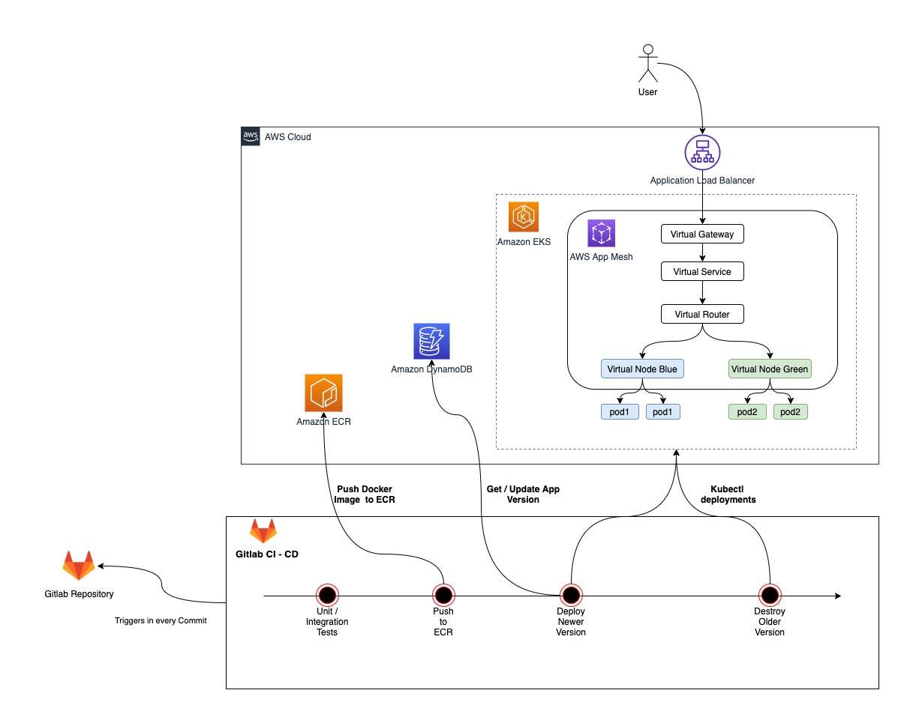
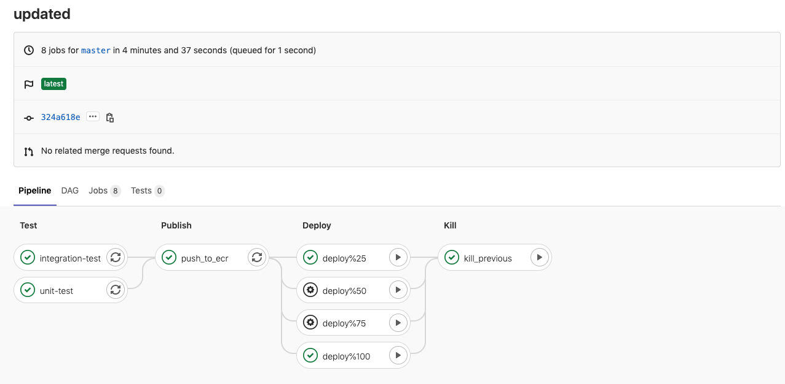

## CI/CD on Amazon EKS using AWS AppMesh and Gitlab CI



##### Steps
1. Check this [manual](infra/README.md), and execute the infrastructure commands to create EKS cluster and its dependencies.
2. Create an empty repo in Gitlab
3. Put following environment variables in CI/CD Settings of created empty repo(step 2).

- `CLUSTER_NAME=<EKS_CLUSTER_NAME>`
- `AWS_ACCESS_KEY_ID=<IAM_ACCESS_KEY_ID>`
- `AWS_SECRET_ACCESS_KEY=<IAM_SECRET_KEY>`
- `AWS_DEFAULT_REGION=<AWS_DEFAULT_REGION(i.e. us-west-2)>`
  
4. Add Gitlab as remote origin, then push this project into created repo in Gitlab 
```
git remote set-url origin <YOUR_GITLAB_REPOSITORY_URL>
git remote -v
git push origin master
```

**Sample Gitlab CI/CD Pipeline:**




## Security

See [CONTRIBUTING](CONTRIBUTING.md#security-issue-notifications) for more information.

## License

This library is licensed under the MIT-0 License. See the LICENSE file.

